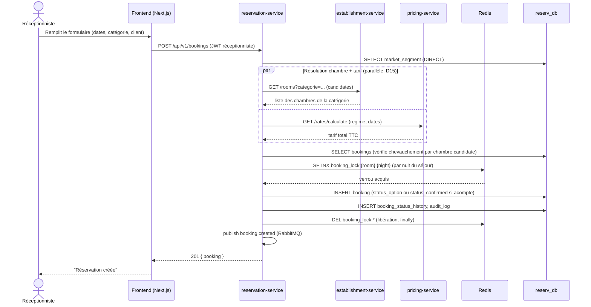

# Workflow A — Réservation Walk-in

Réceptionniste crée une réservation directe pour un client présent. Couvert
par le smoke test Sprint 3 et le scénario E2E Sprint 7
(`frontend/e2e/scenario1-front-office.spec.ts`, qui enchaîne A → D → E → G).

Depuis Sprint 8 (D15), la résolution de chambre (establishment-service) et
le calcul tarifaire (pricing-service) sont lancés en parallèle dès que le
segment de marché est connu, plutôt qu'en série après le verrou Redis —
voir `reservation-service/app/domain/services.py::create_booking`.

**Statut résultant** : `status_option` (expire après `option_expiry_hours`,
job asyncio en arrière-plan) sauf si `deposit_paid=true` →
`status_confirmed` directement.
