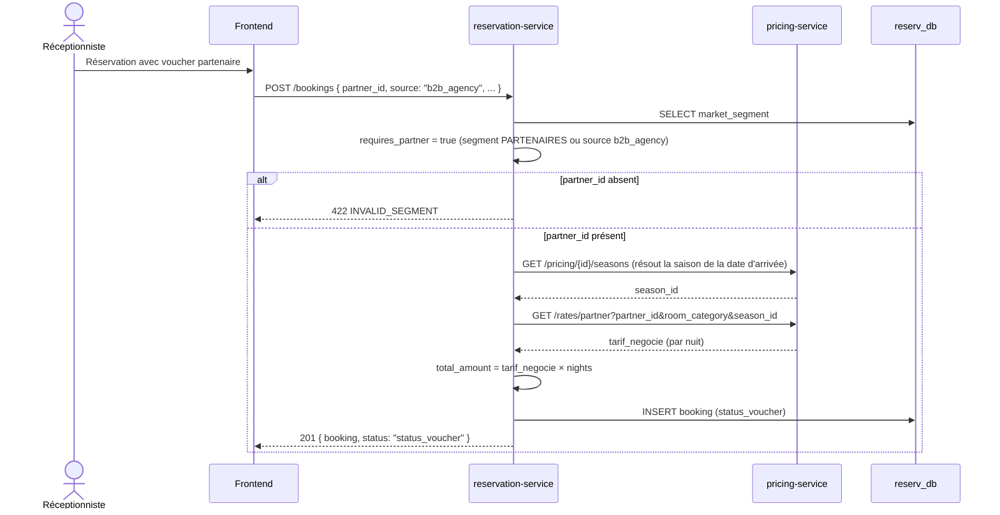

# Workflow B — Réservation B2B (Agence Partenaire)

Même endpoint que le Workflow A (`POST /bookings`), mais avec
`source=b2b_agency` ou un segment `PARTENAIRES`, ce qui force `partner_id`
et bascule le calcul tarifaire sur `pricing-service.calculate_partner_rate`
(tarif négocié par saison, pas la grille publique). Vérifié par
`scripts/smoke_test_sprint3.sh` (bug réel trouvé et corrigé pendant ce
sprint : `tarif_negocie` est un prix par nuit, doit être multiplié par le
nombre de nuits — pas déjà un total comme `calculate_public_rate`).

**Statut résultant** : toujours `status_voucher` (jamais `status_option`,
l'accord partenaire vaut confirmation) — transition ensuite vers
`status_checked_in` au Workflow D comme les autres sources.
