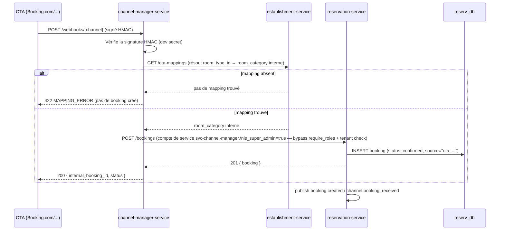

# Workflow C — Réservation OTA (Booking.com, Expedia, Airbnb)

D6 (résolu Sprint 3) : le webhook OTA appelle `reservation-service`
**synchroniquement** (pas de file d'attente tampon) et retourne un vrai
`200 {internal_booking_id, status}`, conforme au contrat initial du spec.
Le mapping `room_type_id` (OTA) → catégorie interne est indispensable — son
absence est un des 5 scénarios bord-de-cas ajoutés en Sprint 7
(`scripts/test_integration_sprint7.py`, `test_ota_webhook_unmapped`, 422
`MAPPING_ERROR`).

**Statut résultant** : toujours `status_confirmed` directement (une
réservation OTA reçue est déjà garantie côté OTA, pas d'étape d'option).
