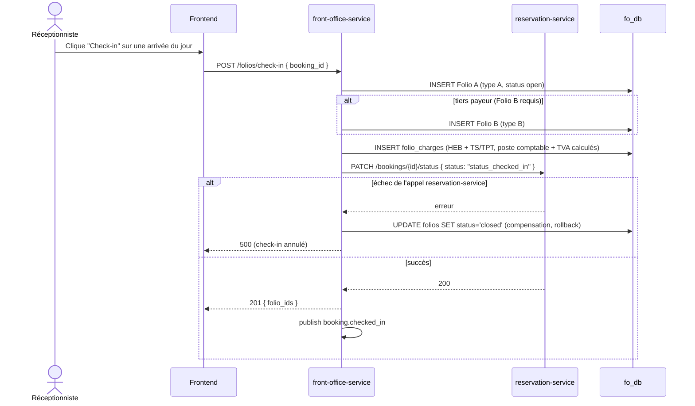

# Workflow D — Check-in

Saga orchestrée par `front-office-service` : crée le(s) Folio(s), charge
l'hébergement + taxes, puis bascule le statut de la réservation. Si l'appel
à reservation-service échoue, les folios déjà créés sont refermés
(compensation) plutôt que laissés orphelins. Couvert par le scénario E2E
Sprint 7 (`scenario1-front-office.spec.ts`).

**Note** : la réouverture d'un folio est **définitivement interdite** (403
systématique, y compris super-admin) — corrections comptables uniquement
via écritures de régularisation datées J (règle spec §6.3, non implémentée
comme "modification" au sens strict mais comme nouvelles lignes).
