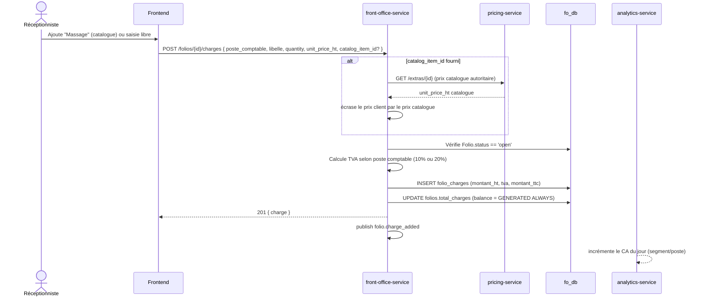

# Workflow E — Ajout d'un Extra en Cours de Séjour

Charge manuelle sur un folio ouvert (Workflow E du spec). Le prix catalogue
(`pricing-service.extras_catalog`) est **autoritaire** sur un prix fourni
par le client — le frontend propose un sélecteur de catalogue en plus de
la saisie manuelle (ajouté lors du passage de couverture frontend post-
Sprint 6). Couvert par le scénario E2E Sprint 7.

