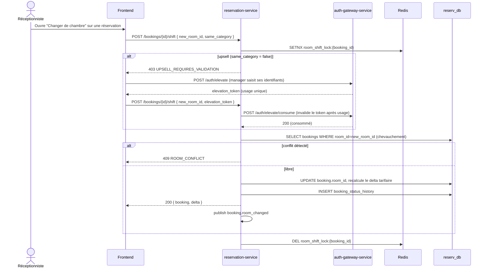

# Workflow F — Room Shifting

Le spec original imagine un planning drag & drop ; ce frontend n'en a pas
(décision confirmée en Sprint 7, D14 : Scénario 4 E2E hors-scope pour cette
raison). Le changement de chambre est un dialogue de formulaire sur la
table des réservations. Simplifications actées en D8 (Sprint 3) :
`same_category` fourni par le frontend, pas de `ROOM_BLOCKED`, pas de
cascade automatique de conflits.

**Vérifié Sprint 7** (`test_integration_sprint7.py`) : le conflit 409 est
un des 5 scénarios bord-de-cas jamais exercé par les smoke tests
précédents.
