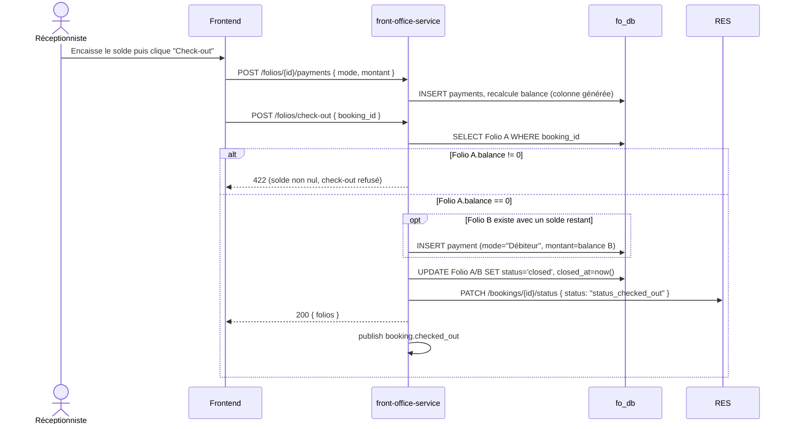

# Workflow G — Check-out

Exige un solde Folio A **exactement à zéro** (pas de dépassement/reste
toléré) ; le Folio B (tiers payeur), lui, est réglé automatiquement via un
paiement mode `Débiteur` quel que soit son solde restant. Couvert par le
scénario E2E Sprint 7.

**Consommateurs de `booking.checked_out`** : housekeeping-service (bascule
la chambre en "Sale"), analytics-service, notification-service,
channel-manager-service (sync retour vers l'OTA si applicable).
