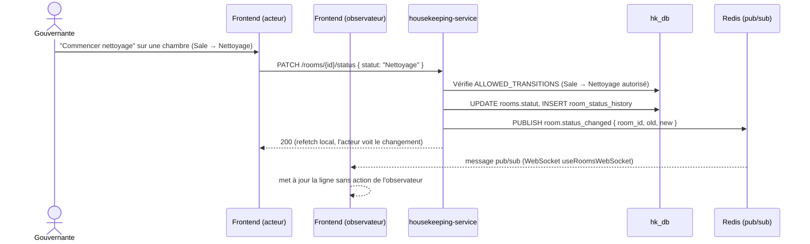

# Workflow H — Gestion Housekeeping (Mobile/Tablette)

Mobile Housekeeping = PWA installable dans le même frontend Next.js (D13,
Sprint 6), pas une app Expo/React Native séparée. Propagation temps réel
vérifiée en vrai par le scénario E2E Sprint 7 (deux contextes navigateur
distincts, WebSocket, pas un simple refetch).

**Bascule de fin de journée (Night Audit → J+1)** : housekeeping-service ne
suit pas d'état "Occupée" dans `Room.statut` — au clôture (Workflow I),
il interroge reservation-service pour les réservations
`status_checked_in`, puis **force** ces chambres à `Sale` en contournant
`ALLOWED_TRANSITIONS` (reset système légitime, pas une action manuelle).

**Incidents** : `fetchRoomHistory`/dialogue "Détails" par chambre expose
l'historique des statuts + incidents signalés (`room_incidents`) —
surfacé côté frontend lors de la passe de couverture post-Sprint 6.
