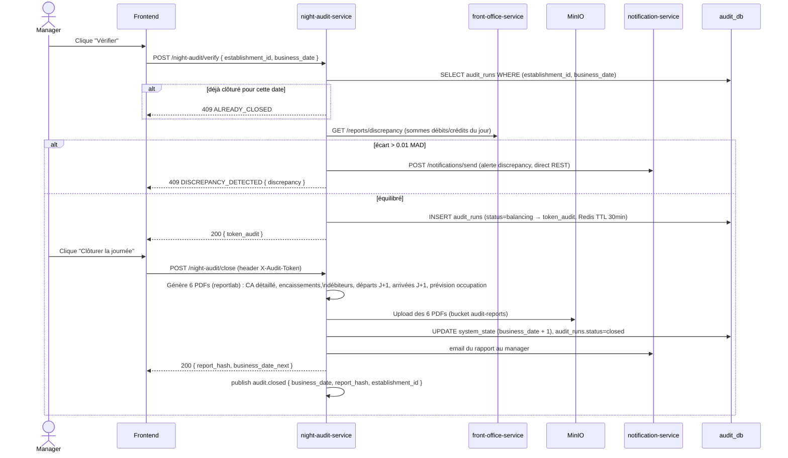

# Workflow I — Night Audit (le plus critique)

Saga en deux temps (`verify` puis `close`), token d'audit à usage unique
(Redis TTL 30 min) entre les deux. Vérifié de bout en bout en Sprint 5
(chemin équilibré) et en Sprint 7 (chemin avec écart détecté, un des 5
scénarios bord-de-cas jamais exercé avant) + le scénario E2E Sprint 7
(manager, chemin réel via l'UI).

**4 consommateurs de `audit.closed`** : front-office-service et
analytics-service (depuis Sprint 4), reservation-service et
housekeeping-service (ajoutés Sprint 5 — verrou `business_date_locks` côté
reservation, bascule forcée des chambres occupées côté housekeeping).
