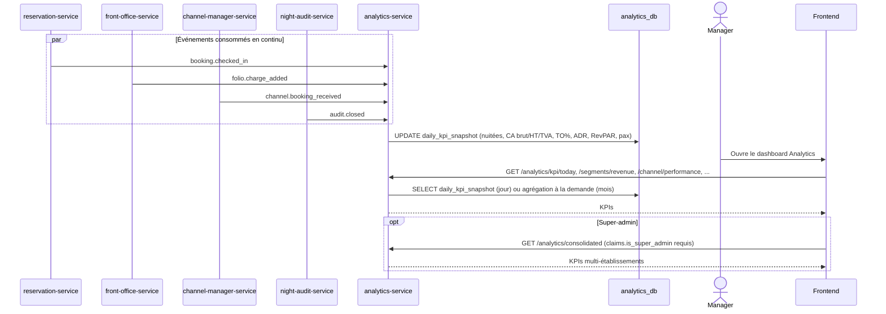

# Workflow J — Dashboard Analytics (Temps Réel + Historique)

Pas de Celery/job planifié (D10, Sprint 4) : `analytics-service` incrémente
ses agrégats en temps réel à partir des événements consommés, plutôt que
de les recalculer périodiquement. Les agrégats mensuels, eux, sont
recalculés à la demande à partir des snapshots journaliers.

**Champs volontairement à 0** (D10, pas de source fiable en Sprint 4) :
`dms` (durée moyenne de séjour) et la `commission` par réservation — non
fabriqués plutôt que faussement précis.
