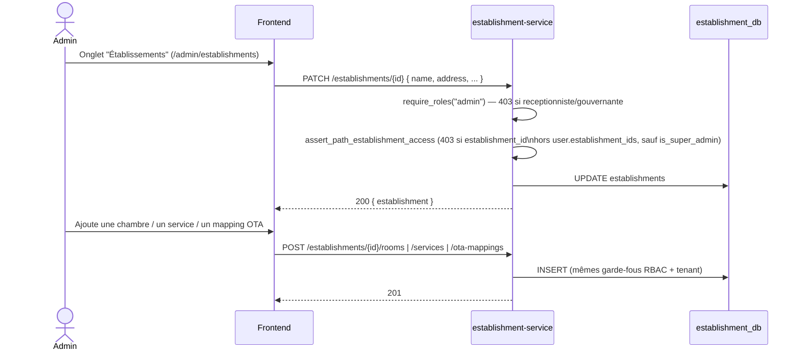

# Workflow K — Configuration d'Établissement (Admin)

CRUD admin-only sur `establishment-service` : établissement, chambres,
services de l'établissement, mappings OTA. RBAC vérifié en vrai en
Sprint 7 (`scripts/security_test_sprint7.sh` — un réceptionniste qui tente
`PATCH /establishments/{id}` reçoit 403) ainsi que l'isolation multi-tenant
(un token limité à un établissement ne peut pas lire un autre
établissement, même en `GET`).

**Consommateurs de la config chambres** : reservation-service (résolution
catégorie→chambre, Workflows A/B/C), channel-manager-service (mapping OTA),
housekeeping-service (réplique son propre `rooms.statut`, D1 — événements
`room.created`/`room.updated` plutôt qu'un appel REST synchrone à chaque
lecture).
